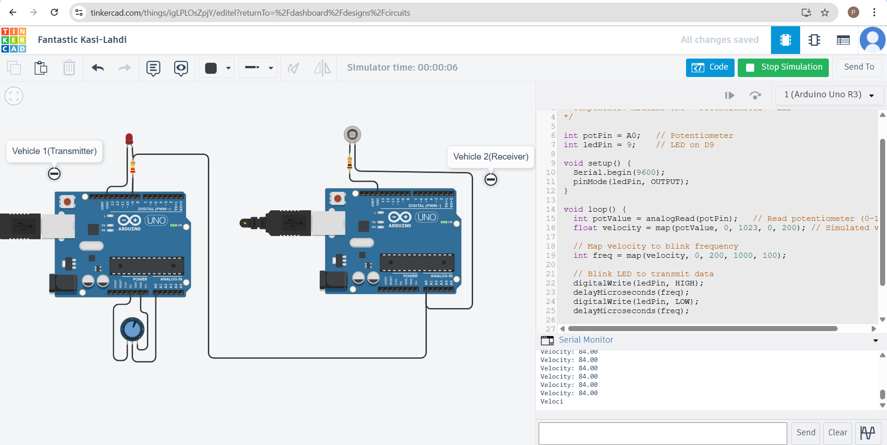
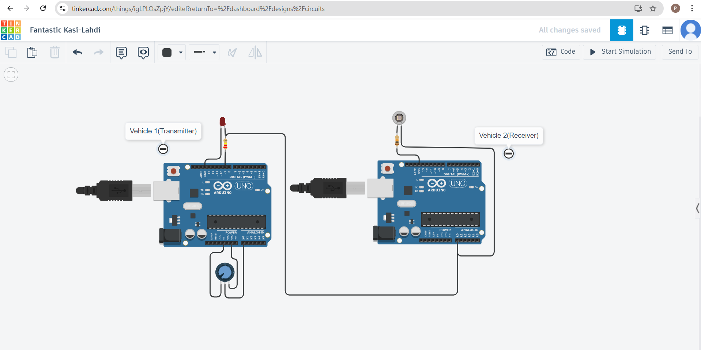

# 🚗 Vehicle-to-Vehicle Communication using Visible Light (VLC)

Arduino-based prototype that transmits vehicle speed via **LED light pulses** and receives it with a **photodiode** for secure, interference-free V2V data sharing.

---

## 🔹 Project Overview
- Demonstrates **V2V communication** using **Visible Light Communication (VLC)**.  
- **Transmitter Vehicle:** Arduino + MPU6050 + LED  
- **Receiver Vehicle:** Arduino + Photodiode  
- Data sent as light pulses → received and decoded into velocity.  

---

## 🔹 Tech Stack
- **Hardware:** Arduino Uno, MPU6050, LED, Photodiode, Resistors, Breadboard  
- **Software:** Arduino IDE (C/C++), Serial Monitor  

---

## 🔹 Block Diagram

---

## 🔹 Circuit Diagram

---

## 🔹 Working Principle
1. MPU6050 senses acceleration.  
2. Arduino calculates velocity.  
3. LED encodes velocity into light pulses.  
4. Photodiode detects pulses → Arduino decodes.  
5. Output displayed in **Serial Monitor**.  

---

## 🔹 Code
- [Transmitter Code](Transmitter_side(Vehicle1).ino)  
- [Receiver Code](Receiver_side(Vehicle2).ino)  

---

## 🔹 Applications
- Vehicle collision avoidance  
- Smart traffic management  
- Platooning (convoy vehicle communication)  
- Secure short-range communication  

---

## 🔹 Future Enhancements
- Extend range using **high-power LEDs**  
- Advanced modulation schemes (OOK, OFDM)  
- Integration with **IoT & 5G networks**  

---

## 🔹 Demo
🎥 Attached the demo video which is carried out in Tinkercad

---

## 🔹 License
MIT License © 2025

